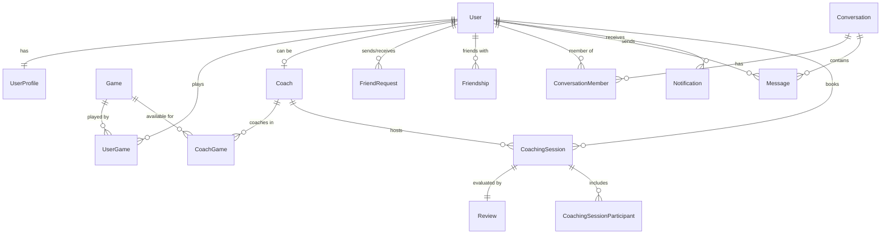

# BeTrueGamers — Database Architecture & Prisma ORM Schema

## Overview
BeTrueGamers uses **Supabase PostgreSQL** as its primary relational database, managed through **Prisma ORM** (`@prisma/client`).
Docker is not required. Connections can be made directly to Supabase via pooled URLs (`DATABASE_URL`) and direct URLs (`DIRECT_URL`).

---

## Entity Relationship Summary



---

## Prisma Schema Models (`backend/prisma/schema.prisma`)

### 1. `User`
- `id` (UUID, Primary Key)
- `email` (String, Unique)
- `username` (String, Unique)
- `passwordHash` (String)
- `role` (`Role`: `USER`, `COACH`, `ADMIN`)
- `isVerified` (Boolean)
- `isActive` (Boolean)
- `isBlocked` (Boolean)
- `avatarUrl`, `bannerUrl`, `lastLoginAt`, `createdAt`, `updatedAt`

### 2. `UserProfile`
- `id` (UUID, Primary Key)
- `userId` (UUID, Foreign Key -> `User` ON DELETE CASCADE)
- `fullName`, `bio`, `discordTag`, `steamId`, `riotId`, `country`, `experienceLevel`, `preferredLanguage`, `achievements`

### 3. `Game` & `UserGame`
- `Game`: `id`, `name`, `slug`, `description`, `genre`, `platforms`, `bannerUrl`, `iconUrl`, `activePlayersCount`, `isActive`
- `UserGame`: `id`, `userId`, `gameId`, `inGameRank`, `mainRole`, `hoursPlayed`, `isFavorite`

### 4. `Coach` & `CoachGame`
- `Coach`: `id`, `userId`, `headline`, `bio`, `coachingExperienceYears`, `hourlyRateUsd`, `languages`, `isVerified`, `isAvailable`, `ratingAvg`, `reviewCount`, `totalSessionsCompleted`
- `CoachGame`: `id`, `coachId`, `gameId`, `highestRank`, `specialization`, `sessionDurationMinutes`

### 5. `FriendRequest` & `Friendship`
- `FriendRequest`: `senderId`, `receiverId`, `status` (`PENDING`, `ACCEPTED`, `REJECTED`, `CANCELLED`)
- `Friendship`: `userId1`, `userId2` (canonical pair ordering)

### 6. `Conversation`, `ConversationMember`, `Message`, `MessageRead`
- `Conversation`: `id`, `title`, `isGroup`, `lastMessageAt`
- `ConversationMember`: `conversationId`, `userId`, `lastReadAt`
- `Message`: `id`, `conversationId`, `senderId`, `content`, `createdAt`
- `MessageRead`: `messageId`, `userId`, `readAt`

### 7. `CoachingSession` & `CoachingSessionParticipant`
- `CoachingSession`: `gamerId`, `coachId`, `gameId`, `status` (`REQUESTED`, `ACCEPTED`, `READY`, `LIVE`, `COMPLETED`, `CANCELLED`), `scheduledAt`, `startedAt`, `endedAt`, `durationMinutes`, `goals`, `notes`
- `CoachingSessionParticipant`: `sessionId`, `userId`, `role`, `isInCall`, `isSharingScreen`

### 8. `Review`
- `sessionId` (Unique), `coachId`, `gamerId`, `rating` (1-5), `reviewText`

### 9. `Notification`
- `userId`, `type` (`FRIEND_REQUEST`, `FRIEND_ACCEPTED`, `COACHING_REQUEST`, `COACHING_ACCEPTED`, `COACHING_START`, `CHAT_MESSAGE`, `SYSTEM`), `title`, `message`, `data`, `isRead`

---

## Supabase Push & Migration

To push this schema directly to your Supabase project without Docker:
```bash
# In backend directory with your Supabase credentials in .env:
npx prisma db push

# To seed initial data:
npm run prisma:seed

# To explore data visually in Prisma Studio:
npm run prisma:studio
```
